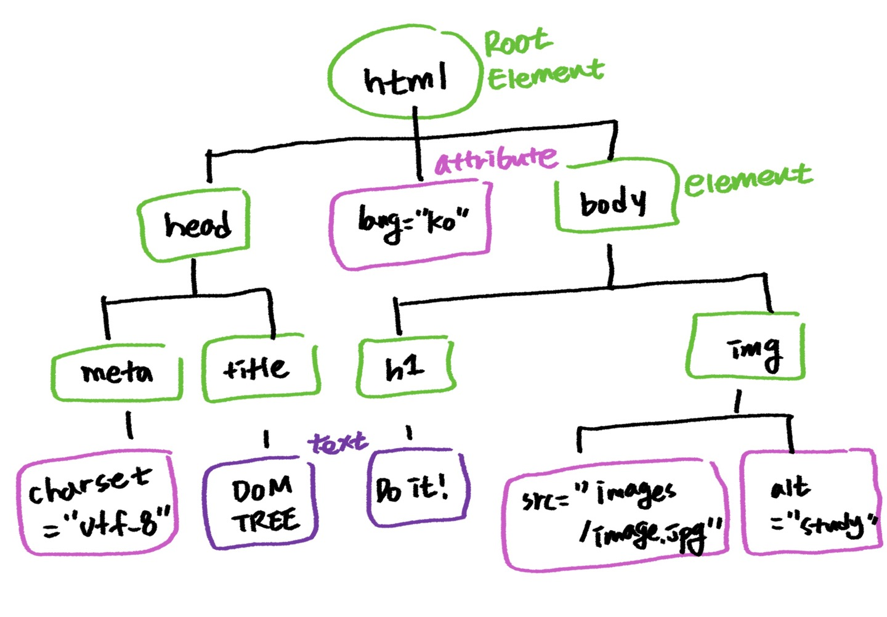

> #### Do it! HTML+CSS+자바스크립트 웹 표준의 정석
 ### [문서 객체 모델(DOM)]
 > 문서 객체 모델(DOM)

 자바스크립트를 이용해 웹 문서에 접근하고 제어할 수 있도록 객체를 사용해 웹 문서를 체계적으로 정리하는 방법

 예를 들어, 웹 문서 전체는 document 객체이고 삽입한 이미지는 image객체이다.  
 이처럼 DOM은 웹 문서와 그 안의 모든 요소를 '객체'로 인식하고 처리한다.

 > DOM 트리
 ```
 <!DOCTYPE html>
 <html lang="ko">
    
    <head>
        <meta charset="UTF-8">
        <title>DOM TREE</title>
    </head>

    <body>
        <h1>Do it!</h1>
        
    </body>
 </html>
 ```

 

 - DOM TREE에서 가지가 갈라져 나간 항목을 노드라고 한다
 - 시작 부분인 HTML을 나무 뿌리에 해당한다고 해 루트노드라고 한다
 - 각 노드 사이 관계를 부모/자식, 형제 간으로 표현할 수 있다. 부모 노드에는 자식노드가 있으며 부모 노드가 같은 형제 노드도 있다.

 > DOM 트리 노드
 1. 모든 HTML태그는 `요소(element)노드`이다.
 2. HTML태그에서 사용하는 텍스트 내용은 자식 노드인 `텍스트(text)노드`이다.
 3. HTML 태그에 있는 속성은 자식 노드인 `속성(attribute)노드`이다.
 4. 주석은 `주석(comment)노드`이다.