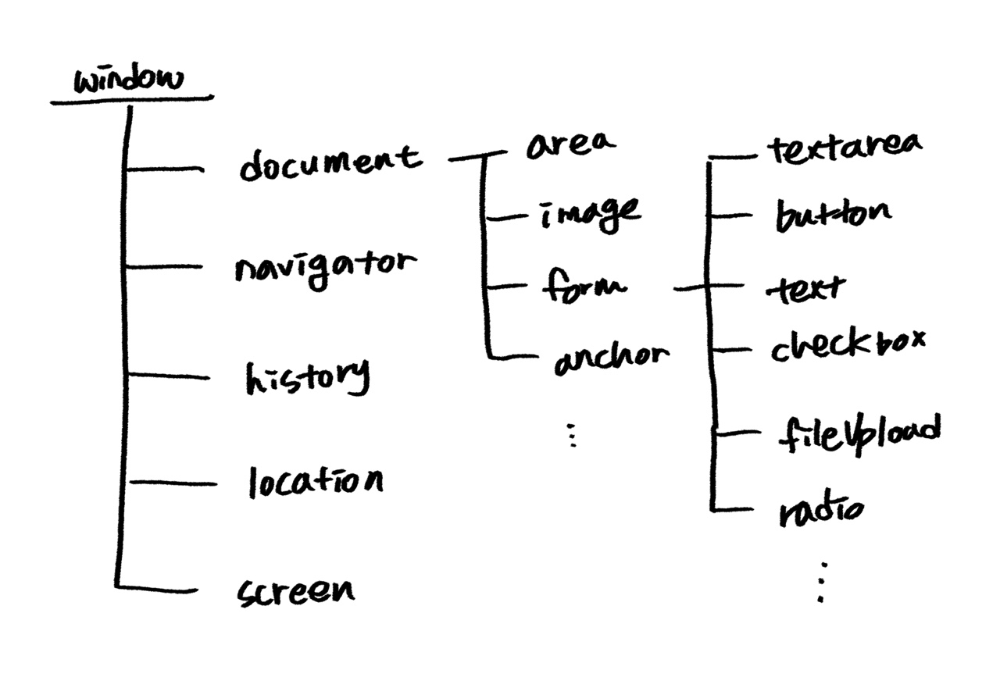

> #### Do it! HTML+CSS+자바스크립트 웹 표준의 정석
 ### [브라우저 관련 객체]
 웹 브라우저가 열리면 가장 먼저 window라는 객체가 만들어지고, 밑으로 하위 요소에 해당하는 객체들이 나타난다.

 하위 객체는 웹 문서와 주소 표시줄처럼 브라우저 요소에 해당하며 각각 다른 하위 객체를 지닌다.

> 주로 사용하는 내장 객체

- window : 브라우저 창이 열릴 때마다 하나씩 만들어짐. 브라우저 창 안의 요소 중에서 최상위에 있음.
- document : 웹 문서마다 하나씩 있으며 `<body>`태그를 만나면 만들어짐. html문서의 정보가 담겨 있음.
- navigator : 현재 사용하는 브라우저의 정보가 들어 있음.
- history : 현재 창에서 사용자의 방문 기록을 저장함.
- location : 현재 페이지의 URL정보가 담겨 있음.
- screen : 현재 사용하는 화면 정보를 다룸.